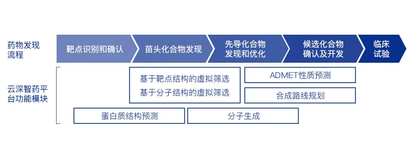

# pharmacy

AI制药路径进展

1. 蛋白质结构预测
   1. 数据集：CASP，CAMEO
   2. 平台：https://drug.ai.tencent.com/
   3. 算法模型：AlphaFlod\(CNN+Rossetta,1d-2d-3d\)
2. 针对靶点筛选苗头化合物
3. ADMET预测：吸收（absorption）、分布（distribution）、代谢（metabolism）、排泄（excretion）和药代动力学（pharmacokinetics，PK）

ref:  
-https://mp.weixin.qq.com/s/0GY-SWFHkf3r7J\_uOblTdA  
-https://www.zhihu.com/question/304484648/answer/544915994

